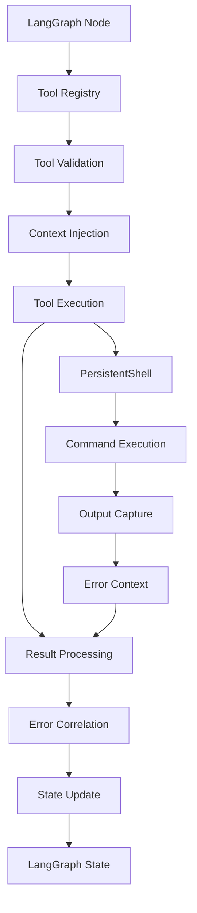
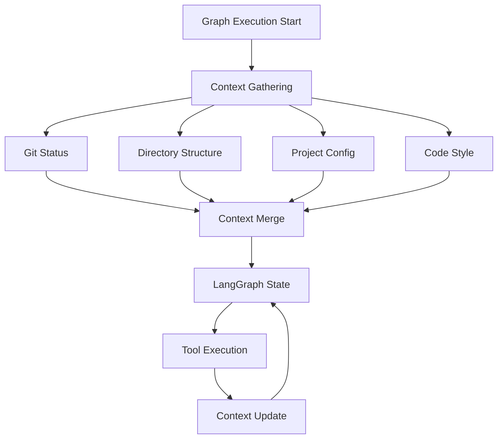

# Integration Design: anon-kode → open-swe

## Overview

This document outlines the detailed integration design for merging anon-kode's sophisticated features into open-swe's architecture.

## Integration Mapping

### Tool System Integration

| anon-kode Tool | open-swe Integration | Priority | Complexity |
|----------------|---------------------|----------|------------|
| PersistentShell | Enhanced shell.ts | High | Medium |
| FileEditTool | tools/file-edit.ts | High | Low |
| FileReadTool | tools/file-read.ts | High | Low |
| FileWriteTool | tools/file-write.ts | High | Low |
| GrepTool | tools/grep.ts | High | Medium |
| GlobTool | tools/glob.ts | Medium | Low |
| lsTool | tools/ls.ts | Medium | Low |
| BashTool | Enhanced shell.ts | High | Medium |
| ArchitectTool | tools/architect.ts | Medium | High |
| AgentTool | Integration with graphs | Low | High |
| MCPTool | tools/mcp-tool.ts | Medium | High |
| MemoryReadTool | context/memory.ts | Low | Medium |
| MemoryWriteTool | context/memory.ts | Low | Medium |
| NotebookEditTool | tools/notebook-edit.ts | Low | Medium |
| NotebookReadTool | tools/notebook-read.ts | Low | Medium |
| StickerRequestTool | tools/sticker.ts | Low | Low |
| ThinkTool | Integration with graphs | Low | Medium |

### Context System Integration

| anon-kode Context | open-swe Integration | Implementation |
|-------------------|---------------------|----------------|
| Git Status | context/git-context.ts | Direct port with caching |
| Directory Structure | context/project-context.ts | Optimized for web UI |
| README Parsing | context/project-context.ts | Enhanced with metadata |
| Code Style Detection | context/code-style.ts | ML-based detection |
| File Timestamps | context/change-tracking.ts | Real-time monitoring |
| Project Config | config/unified-config.ts | Merged with env config |

### Service Integration

| anon-kode Service | open-swe Integration | Notes |
|-------------------|---------------------|-------|
| MCP Client | services/mcp-client.ts | Full port with adaptations |
| Multi-Provider AI | services/ai-providers.ts | Integrate with LangGraph |
| Cost Tracker | services/cost-tracker.ts | Web UI integration |
| OAuth Service | services/oauth.ts | GitHub integration |

## Data Flow Design

### Enhanced Tool Execution Flow



### Context Flow Integration



## File Structure Design

### New Directory Structure

```
apps/open-swe/src/
├── context/                    # Rich context system
│   ├── git-context.ts         # Git status and history
│   ├── project-context.ts     # Project structure analysis
│   ├── code-style.ts          # Code style detection
│   ├── change-tracking.ts     # File change monitoring
│   └── index.ts               # Context aggregation
├── services/
│   ├── mcp-client.ts          # Model Context Protocol
│   ├── ai-providers.ts        # Multi-provider support
│   ├── cost-tracker.ts        # Usage and cost monitoring
│   └── oauth.ts               # OAuth integration
├── tools/
│   ├── base-tool.ts           # Base tool interface
│   ├── tool-registry.ts       # Tool management
│   ├── validation.ts          # Tool validation
│   ├── persistent-shell.ts    # Enhanced shell system
│   ├── file-operations/       # File manipulation tools
│   │   ├── file-edit.ts
│   │   ├── file-read.ts
│   │   └── file-write.ts
│   ├── search/                # Search and analysis tools
│   │   ├── grep.ts
│   │   ├── glob.ts
│   │   └── ls.ts
│   └── mcp-tool.ts           # MCP tool integration
├── config/
│   ├── unified-config.ts      # Unified configuration
│   ├── migration.ts           # Config migration
│   └── providers.ts           # AI provider configs
└── utils/
    ├── shell-session.ts       # Shell session management
    ├── ripgrep.ts            # Advanced search utilities
    └── error-correlation.ts   # Error tracking
```

## Interface Definitions

### Enhanced Tool Interface

```typescript
interface EnhancedTool {
  name: string;
  description: string | ((params: any) => Promise<string>);
  inputSchema: z.ZodSchema;
  outputSchema: z.ZodSchema;
  
  // Enhanced features from anon-kode
  validate?: (input: any, context: ToolContext) => ValidationResult;
  permissions?: PermissionCheck[];
  progressTracking?: boolean;
  
  // Integration with LangGraph
  execute(input: any, context: ToolContext): Promise<ToolResult>;
}

interface ToolContext {
  sessionId: string;
  projectContext: ProjectContext;
  gitContext: GitContext;
  codeStyle: CodeStyle;
  shell: PersistentShell;
  costTracker: CostTracker;
}

interface ToolResult {
  success: boolean;
  data: any;
  error?: ErrorContext;
  metadata: {
    duration: number;
    cost?: number;
    correlationId: string;
  };
}
```

### Context System Interface

```typescript
interface ProjectContext {
  directoryStructure: string;
  readme?: string;
  packageJson?: any;
  gitignore?: string[];
  codeStyle: CodeStyle;
  fileTimestamps: Map<string, number>;
}

interface GitContext {
  branch: string;
  mainBranch: string;
  status: string;
  recentCommits: GitCommit[];
  authorCommits: GitCommit[];
  isClean: boolean;
}

interface CodeStyle {
  language: string;
  formatter?: string;
  linter?: string;
  conventions: StyleConvention[];
}
```

## Migration Strategy

### Phase 1: Foundation Setup
1. Create new directory structure
2. Implement base tool interface
3. Set up tool registry
4. Integrate PersistentShell

### Phase 2: Core Tool Migration
1. Port file operation tools
2. Implement search tools
3. Add context system
4. Integrate with LangGraph

### Phase 3: Advanced Features
1. MCP integration
2. Multi-provider AI support
3. Cost tracking system
4. Configuration unification

### Phase 4: Testing & Optimization
1. Comprehensive test suite
2. Performance optimization
3. Error handling enhancement
4. Documentation completion

## Configuration Migration

### Unified Configuration Schema

```typescript
interface UnifiedConfig {
  // From open-swe
  langsmith: {
    project: string;
    apiKey: string;
    tracing: boolean;
  };
  
  // From anon-kode
  aiProviders: {
    anthropic?: { apiKey: string };
    openai?: { apiKey: string };
    google?: { apiKey: string };
  };
  
  // Enhanced features
  tools: {
    enabled: string[];
    permissions: ToolPermissions;
  };
  
  context: {
    enableGitTracking: boolean;
    enableFileTracking: boolean;
    cacheTimeout: number;
  };
  
  mcp: {
    servers: MCPServerConfig[];
    enabled: boolean;
  };
}
```

## Testing Strategy

### Unit Tests
- Individual tool functionality
- Context system components
- Configuration management
- Error handling

### Integration Tests
- Tool registry functionality
- LangGraph integration
- Context flow
- Shell session management

### End-to-End Tests
- Complete workflow execution
- Multi-tool operations
- Error recovery
- Performance benchmarks

## Performance Considerations

### Optimization Strategies
1. **Context Caching**: Memoize expensive context operations
2. **Lazy Loading**: Load tools and context on demand
3. **Connection Pooling**: Reuse shell sessions and API connections
4. **Resource Limits**: Implement timeouts and resource constraints

### Monitoring
1. **Cost Tracking**: Real-time cost and usage monitoring
2. **Performance Metrics**: Tool execution times and resource usage
3. **Error Tracking**: Comprehensive error logging and correlation
4. **Health Checks**: System health and availability monitoring

This integration design ensures a smooth migration while preserving the strengths of both systems and creating new capabilities through their combination.

